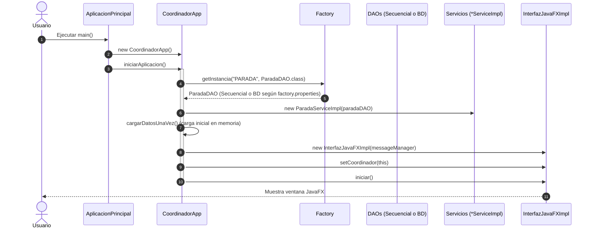

# 01 - Análisis de Arquitectura y Estructura (`sistema_colectivos_honolulu`)

El proyecto `sistema_colectivos_honolulu` implementa una arquitectura en capas basada en **MVC con Coordinador de Aplicación (Application Coordinator)** y **Factoría Dinámica**.

---

## 🗂️ Mapeo de Paquetes y Responsabilidades

```
colectivo/
├── aplicacion/
│   ├── AplicacionPrincipal.java  # Punto de entrada main(), inicia CoordinadorApp (sin JavaFX)
│   └── Constantes.java           # Constantes globales del sistema
├── conexion/
│   ├── BDConexion.java           # Singleton JDBC que lee jdbc.properties y gestiona ShutdownHook
│   └── Factory.java              # Factoría abstracta con reflexión y caché singleton
├── controlador/
│   └── CoordinadorApp.java       # Orquestador maestro que ensambla DAOs, Servicios y la Vista
├── dao/
│   ├── DAO.java                  # Interfaz genérica CRUD <K, V>
│   ├── LineaDAO.java             # Interfaz DAO para Línea
│   ├── ParadaDAO.java            # Interfaz DAO para Parada
│   ├── TramoDAO.java             # Interfaz DAO para Tramo
│   ├── BD/                       # Implementaciones JDBC (PostgreSQL)
│   │   ├── LineaDAOBD.java
│   │   ├── ParadaDAOBD.java
│   │   └── TramoDAOBD.java
│   └── secuencial/               # Implementaciones de Archivo de Texto (.txt)
│       ├── LineaDAOSecuencial.java
│       ├── ParadaDAOSecuencial.java
│       └── TramoDAOSecuencial.java
├── modelo/
│   ├── Linea.java                # Entidad de dominio POJO puro
│   ├── Parada.java               # Entidad de dominio POJO puro
│   └── Tramo.java                # Entidad de dominio POJO puro
├── negocio/
│   ├── Calculo.java              # Algoritmos de cálculo de rutas y tiempos
│   ├── HelperRecorrido.java      # Utilidades de negocio para recorridos
│   ├── Recorrido.java            # Objeto de resultado de ruta
│   ├── CacheDatosTransporte.java # Caché de datos maestros en memoria
│   └── estrategias/              # Patrón Strategy para búsquedas de recorridos
├── servicio/
│   ├── LineaService.java / LineaServiceImpl.java
│   ├── ParadaService.java / ParadaServiceImpl.java
│   └── TramoService.java / TramoServiceImpl.java
├── ui/
│   ├── Interfaz.java             # Contrato de la Vista (iniciar(), setCoordinador())
│   ├── InterfazJavaFXImpl.java   # Implementación en JavaFX
│   ├── JavaFXLauncher.java       # Lanzador secundario de JavaFX
│   ├── PresentadorVistaPrincipal.java # Presentador de la pantalla principal (MVP)
│   ├── TareaCargaDatos.java      # Tarea en background para inicialización
│   └── componentes/              # Tarjetas, visor de mapas y pantallas de carga
└── util/
    ├── DiaSemana.java            # Enum para días de la semana
    ├── DatosEntrada.java         # DTO de entrada para consultas
    └── MessageManager.java       # Gestor singleton de ResourceBundle i18n
```

---

## 🔄 Flujo de Ejecución del Sistema



---

## 💡 Lecciones Clave para MUD

1. **La clase `AplicacionPrincipal` no hereda de `javafx.application.Application`**: Esto evita errores de inicialización del runtime de JavaFX y permite correr tests o consolas sin levantar el toolkit gráfico.
2. **El `CoordinadorApp` actúa como fachada y ensamblador**: La UI solo habla con el Coordinador. La UI nunca sabe de dónde salieron los datos ni conoce la clase `Factory` ni los DAOs.
3. **Persistencia 100% intercambiable**: Cambiando una sola línea en `factory.properties`, todo el sistema cambia entre archivos de texto `.txt` y PostgreSQL, sin recompilar una sola línea de código Java.
